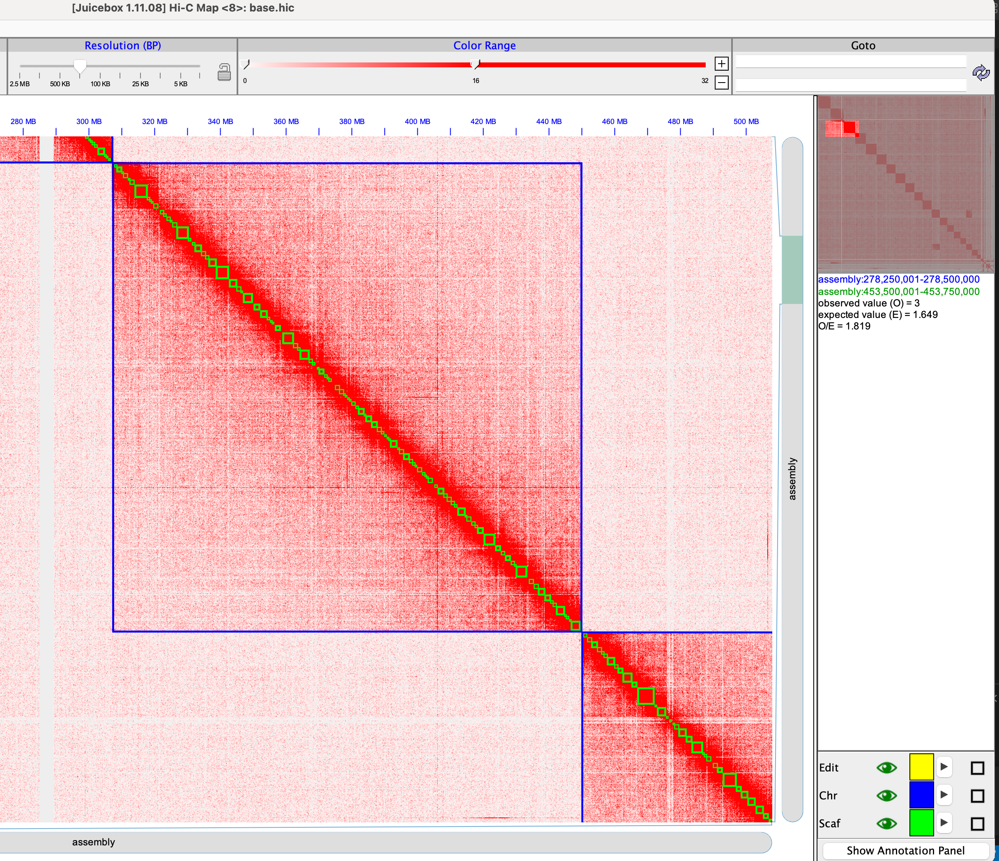

# GreenHill

 
 
 
 

[](https://anaconda.org/bioconda/greenhill) 
[](https://github.com/ShunOuchi/GreenHill/actions)
](https://zenodo.org/badge/latestdoi/463034252)

- [GreenHill](#greenhill)
  - [Description](#description)
  - [Author](#author)
  - [Requirements](#requirements)
  - [Installation](#installation)
    - [Install from source](#install-from-source)
    - [Install through conda](#install-through-conda)
  - [Synopsis](#synopsis)
    - [Inputs](#inputs)
    - [Commands](#commands)
    - [Final output](#final-output)
  - [Example](#example)
    - [Example 1. I have Platanus-allee assembly (Haplotype-aware style input)](#example-1-i-have-platanus-allee-assembly-haplotype-aware-style-input)
    - [Example 2. I have FALCON-Unzip assembly (Psuedo-haplotype style input)](#example-2-i-have-falcon-unzip-assembly-psuedo-haplotype-style-input)
    - [Example 3. I have Canu assembly (Mixed-haplotype style input)](#example-3-i-have-canu-assembly-mixed-haplotype-style-input)
  - [Usage](#usage)
    - [Command](#command)
    - [Options](#options)
    - [Input format:](#input-format)
    - [Final output:](#final-output-1)
    - [Other misc outputs:](#other-misc-outputs)
  - [Notes](#notes)


## Description
GreenHill is a de novo chromosome-level scaffolding and phasing tool using Hi-C.
GreenHill generates chromosome-level haplotypes by scaffolding and phasing
the input contigs using a combination of information from Hi-C and other reads (PE, MP, LongRead).


## Author
Shun Ouchi and Rei Kajitani at Tokyo Institute of Technology wrote key source codes.
Address for this tool: <platanus@bio.titech.ac.jp>


## Requirements
* GCC
    - <https://gcc.gnu.org/>
    - version >= 4.8, with OpenMP
    - To compile the source code.

* Minimap2
    - <https://github.com/lh3/minimap2>
    - For mapping PacBio/Oxford-Nanopore long reads, and doing self align.

## Installation
### Install from source
Install the dependencies above.
* GCC
* Minimap2

Compile (make), and copy greenhill to a directory listed in PATH.
```sh
git clone https://github.com/ShunOuchi/GreenHill.git
cd src
make
cp greenhill <installation_path>
```
### Install through conda
On a new conda environment, run:
```sh
conda install -c bioconda greenhill
```
Or, if you want to have a separate conda environment for GreenHill
```sh
conda create -n greenhill -c bioconda greenhill
```
You will then need to activate the greenhill envirionment before using it with:
```sh
conda activate greenhill
```


## Synopsis
### Inputs
* Input assembly (required)
    * Haplotype-aware style input (such as [Platanus-allee](http://platanus.bio.titech.ac.jp/platanus2)):<br>
      primaryBubble.fa secondaryBubble.fa nonBubble.fa
    * Pseudo-haplotype style input (such as [FALCON-Unzip](https://github.com/PacificBiosciences/FALCON_unzip)) or Mixed-haplotype style input (such as [Canu](https://github.com/marbl/canu)):<br>
      contigs.fa
* Input reads
    * Hi-C reads: HIC_1.fq HIC_2.fq (required)
    * Illumina paired-end: PE_1.fq PE_2.fq (optional)
    * Illumina mate-pair : MP_1.fq MP_2.fq (optional)
    * PacBio/Oxford-Nanopore long reads  : longread.fq (optional)

### Commands

* for Haplotype-aware style input
```
greenhill \
-c nonBubble.fa \
-b primaryBubble.fa secondaryBubble.fa \
-IP1 PE_1.fq PE_2.fq \
-OP2 MP_1.fq MP_2.fq \
-p longread.fq \
-HIC HIC_1.fq HIC_2.fq \
2>3D.log
```

* for Pseudo-haplotype or Mixed-haplotype style input
```
greenhill \
-cph contigs.fa \
-IP1 PE_1.fq PE_2.fq \
-OP2 MP_1.fq MP_2.fq \
-p longread.fq \
-HIC HIC_1.fq HIC_2.fq \
2>3D.log
```

### Final output
    out_afterPhase.fa (phased diploid scaffolds)


---
## Example
Below is showing examples how to run GreenHill using test dataset.
The test dataset is the simulated diploid dataset of _Caenorhabditis elegans_ chr1.
### Example 1. I have Platanus-allee assembly (Haplotype-aware style input)
```
greenhill \
-c Platanus-allee_result/out_nonBubbleOther.fa \
-b Platanus-allee_result/out_primaryBubble.fa Platanus-allee_result/out_secondaryBubble.fa \
-IP1 reads/PE_*.fq.gz \
-OP2 reads/MP5k_*.fq.gz \
-OP3 reads/MP9k_*.fq.gz \
-p reads/longread.fq.gz \
-HIC reads/HIC_1.fq.gz reads/HIC_2.fq.gz
```
### Example 2. I have FALCON-Unzip assembly (Psuedo-haplotype style input)
```
greenhill \
-cph FALCON-Unzip_result/cns_p_ctg.fa FALCON-Unzip_result/cns_h_ctg.fa \
-p reads/longread.fq.gz \
-HIC reads/HIC_1.fq.gz reads/HIC_2.fq.gz
```
### Example 3. I have Canu assembly (Mixed-haplotype style input)
```
greenhill \
-cph Canu_result/asm.contigs.fa \
-p reads/longread.fq.gz \
-HIC reads/HIC_1.fq.gz reads/HIC_2.fq.gz
```

---
## Usage
### Command
```sh
greenhill [OPTIONS] 2>log
```
### Options
    -o STR                             : prefix of output file and directory (do not use "/", default out, length <= 200)
    -c FILE1 [FILE2 ...]               : contig (or scaffold) file (fasta format; for Haplotype-aware style input)
    -b FILE1 [FILE2 ...]               : bubble seq file (fasta format; for Haplotype-aware style input)
    -cph FILE1 [FILE2 ...]             : contig (or scaffold) file (fasta format; for Pseudo-haplotype or Mixed-haplotype style input; only effective without -c, -b option)
    -ip{INT} PAIR1 [PAIR2 ...]         : lib_id inward_pair_file (interleaved file, fasta or fastq)
    -IP{INT} FWD1 REV1 [FWD2 REV2 ...] : lib_id inward_pair_files (separate forward and reverse files, fasta or fastq)
    -op{INT} PAIR1 [PAIR2 ...]         : lib_id outward_pair_file (interleaved, fasta or fastq)
    -OP{INT} FWD1 REV1 [FWD2 REV2 ...] : lib_id outward_pair_files (separate forward and reverse files, fasta or fastq)
    -p PAIR1 [PAIR2 ...]               : long-read file (PacBio, Nanopore) (fasta or fastq)
    -hic PAIR1 [PAIR2 ...]             : HiC_pair_files (reads in 1 file, fasta or fastq)
    -HIC FWD1 REV1 [FWD2 REV2 ...]     : HiC_pair_files (reads in 2 files, fasta or fastq)
    -t INT                             : number of threads (default 1)
    -tmp DIR                           : directory for temporary files (default .)
    -l INT                             : minimum number of links to scaffold (default 3)
    -k INT                             : minimum number of links to phase variants (default 1)
    -s INT1 [INT2 ...]                 : mapping seed length for short reads (default 32 64 96)
    -mapper FILE                       : path of mapper executable file (default minimap2, only effective with -p option)
    -minimap2_sensitive                : sensitive mode for minimap2 (default, off; only effective with -p option)

### Input format:
   Uncompressed and compressed (gzip or bzip2) files are accepted for -c, -ip, -IP, -op, -OP, -p, -hic and -HIC option.

### Final output:
   PREFIX_afterPhase.fa

### Other misc outputs:
   PREFIX_*

PREFIX is specified by -o


---
## Manual review with Juicebox
Resulting scaffolds can be reviewed and curated with Juicebox Assembly Tool (JBAT). This can be accomplished using the programs below:
- [seqkit](https://bioinf.shenwei.me/seqkit/)
- juicer.sh ([Juicdbox](https://github.com/aidenlab/Juicebox))
- generate-assembly-file-from-fasta.awk ([3D-DNA pipeline](https://github.com/aidenlab/3d-dna))
- run-assembly-visualizer.sh ([3D-DNA pipeline](https://github.com/aidenlab/3d-dna))
- fasta_to_juicebox_assembly.py (in the utils directory)
### Command example
```sh
path_juicer=/path/to/juicer
path_3d=/path/to/3d_dna_pipeline
path_greenhill=/path/to/greenhill

seqkit sort -lr out_afterPhase.fa >base.fa
bwa index base.fa >bwa_index.log 2>&1
seqkit fx2tab -nl base.fa >base.sizes

juicer.sh -D $path_juicer -d $PWD -g base -s none -z base.fa -p base.sizes >juicer.log.o 2>juicer.log.e
awk -f $path_3d/utils/generate-assembly-file-from-fasta.awk base.fa >base.assembly 2>generate.log.e
$path_3d/visualize/run-assembly-visualizer.sh base.assembly aligned/merged_nodups.txt >visualizer.log.o 2>visualizer.log.e
python $path_greenhill/utils/fasta_to_juicebox_assembly.py base.fa >base.ctg_info.assembly
```
Then, you can input `base.hic` and `base.ctg_info.assembly` into [Juicebox](https://github.com/aidenlab/Juicebox). See the [cookbook](https://aidenlab.org/assembly/manual_180322.pdf) for the details of the review process.


Finally, the reviwed assembly file, `base.ctg_info.review.assembly` (output of "Export Assembly" in Juicebox), is converted into the final FASTA file. 
```sh
$path_3d/run-asm-pipeline-post-review.sh -r base.ctg_info.review.assembly base.fa aligned/merged_nodups.txt >post_review.log.o 2>post_review.log.e
```


---
## Notes
* Compressed input files

Both uncompressed and compressed (gzip or bzip2) FASTA/FASTQ files are accepted.
Formats are auto-detected. Internally, "file -bL", "gzip -cd" and "bzip2 -cd" commands, which can be
used in most of the UNIX OSs, are utilized.

* Minimap2

This tool is used to align PacBio/Oxford-Nanopore long reads and to do self align.
When long reads are input through the -p option, please check Minimap2 is installed as "minimap2" command
or specify the path of Minimap2 using the -mapper option.

* Paired-end (mate-pair) input

Paired libraries are classified into "inward-pair" and "outward-pair" according to the sequence direction.
For file formats, separate and interleaved files can be input through -IP (-OP) and -ip (-op)
options, respectively.

Inward-pair (usually called "paired-end", accepted in options "-IP" or "-ip"):

    FWD --->
        5' -------------------- 3'
        3' -------------------- 5'
                        <--- REV

Outward-pair (usually called "mate-pair", accepted in options "-OP" or "-op"):

                        ---> REV
        5' -------------------- 3'
        3' -------------------- 5'
    FWD <---

Example inputs:

    Inward-pair (separate, insert=300)   : PE300_1.fq PE300_2.fq
    Inward-pair (interleaved, insert=500): PE500_pair.fq
    Outward-pair (separate, insert=2k)   : MP2k_1.fa MP2k_2.fq

Corresponding options:

    -IP1 PE300_1_pair.fq PE300_2.fq \
    -ip2 PE500_pair.fq \
    -OP3 MP2k_1.fq MP2k_2.fq

